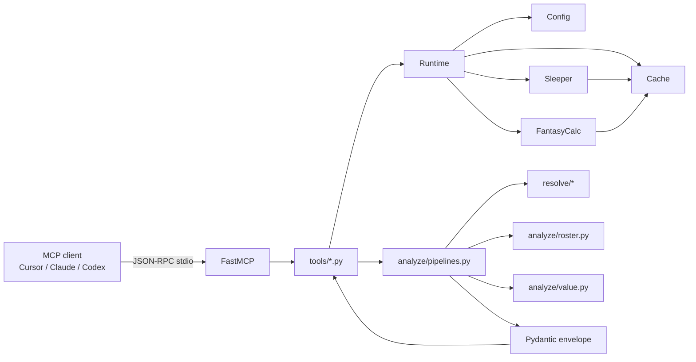

# Yellow Sleeper — Technical Overview

Local, single-user, read-only **stdio MCP server** for one Sleeper dynasty league. It answers roster, pick, value, and trade-guardrail questions for a configured owner. It does not place waivers, send trades, host HTTP, or call paid models.

Current tree is **v0.3.0** (Python 3.11+, `uv`, FastMCP). Canonical product contracts remain `PRD.md`, `TOOL_CONTRACTS.md`, `TECHNICAL_SPEC.md`, and `DECISIONS.md`. This document is a developer map of how the installed code is structured and how it runs.

---

## Core Components

Layered package under `src/yellow_sleeper/`. Tools are thin MCP wrappers; domain logic lives in `analyze/`, `resolve/`, `clients/`, and `store/`.

### Entry and process wiring

- `__main__.py` — CLI `yellow-sleeper`. `--help` works with no league identity. Otherwise starts the MCP server.
- `server.py` — single `FastMCP("yellow-sleeper")` instance. Lifespan creates a `Runtime`, stores it globally, and closes the HTTP client on shutdown. Importing `tools` registers all `@mcp.tool()` functions.
- `runtime.py` — composition root. `Runtime` holds `Config`, `Cache`, shared `httpx.AsyncClient`, `SleeperClient`, and `FantasyCalcClient`. Exposes cached accessors (`players()`, `values()`, `snapshot()`, `draft_state()`) and `refresh_all()`.
- `config.py` — YAML + env loader. Static keys (league id, username, format, cache dir, TEP tier, overlay path): YAML > env. Policy lists (untouchables / protected players / pick patterns): tool override > YAML > env. Identity sentinels (`0`, `changeme`, `your_league_id`) are rejected. Policy YAML is hot-reloaded on mtime change.

### MCP tools (`tools/`)

Eleven `dynasty_*` tools, one file each. Pattern: `get_runtime()` → fetch cached data → pipeline builder → `model_dump(mode="json")`.

| Tool | Responsibility |
| --- | --- |
| `dynasty_health_check` | Config, cache freshness, optional live probes |
| `dynasty_get_my_roster` | Configured owner’s roster, values, policy flags |
| `dynasty_find_roster` | Fuzzy roster search |
| `dynasty_list_traded_picks` | League traded-pick market |
| `dynasty_list_my_picks` | Native + traded-in picks (optional traded-away) |
| `dynasty_get_player_value` | FantasyCalc lookup; CSV overlay wins if loaded |
| `dynasty_analyze_trade` | Resolve assets, guardrails, value math, roster context |
| `dynasty_league_power_map` | Per-team value/age/pick rollups |
| `dynasty_whats_on_the_clock` | Draft clock / recent picks |
| `dynasty_best_player_available` | Rookie BPA board |
| `dynasty_refresh_cache` | Refresh players/values/snapshot/draft |

### Contract models (`models/`)

Pydantic v2 models matching `TOOL_CONTRACTS.md`. Shared envelope on every tool response:

- `schema_version: "1.0"`
- Independent statuses: `policy_status` (`OK` | `BLOCKED`), `resolution_status` (`OK` | `NEEDS_CLARIFICATION`), `data_status` (`COMPLETE` | `PARTIAL` | `UNAVAILABLE`)
- `blocking_rules[]`, `policy_flags[]`, `source_notes[]`, `config_sources[]`

Validators enforce: `BLOCKED` iff `blocking_rules` is non-empty; stale source notes require an explanation; blocked trades must not include `value_math` or `roster_context`.

### HTTP clients (`clients/`)

- `http.py` — one shared `httpx.AsyncClient` (connect 3s / read 5s, connection limits, `User-Agent: yellow-sleeper/1.0`).
- `SleeperClient` — `https://api.sleeper.app/v1`. Semaphore(10), one retry on 5xx/network/timeout. League snapshot is a `TaskGroup` of league, rosters, users, traded_picks, drafts. Draft state joins draft + picks; TTL is 30s while `status == "drafting"`, else 1h.
- `FantasyCalcClient` — `https://api.fantasycalc.com/values/current`. Query params derived from `league_format` (`numTeams` 8/10/12/14, `numQbs` 1/2, `ppr` 0/0.5/1, `tep` none/te+/te++). Unsupported formats raise `UnsupportedValuationQuery` and do **not** reuse another board.

### File cache (`store/`)

Atomic JSON writes (`tempfile` + `os.replace`), one `asyncio.Lock` per cache key (plus variant). Fetch failure serves stale if the file exists.

| Key | TTL | Scope |
| --- | --- | --- |
| `sleeper_players_nfl.json.gz` | 24h | global |
| `league_snapshot__<league_id>.json` | 5 min | league |
| `draft_state__<draft>__league-<id>.json` | 30s / 1h | draft + league |
| `fantasycalc_values__v1__<sorted-query>[__overlay-on].json` | 6h | query (+ overlay) |

Legacy unscoped files are never reused.

### Resolution (`resolve/`)

- `players.py` — RapidFuzz WRatio. ≥88 auto-resolve, 70–88 `NEEDS_CLARIFICATION` with candidates, <70 unresolved. Exact Sleeper id is 100.
- `rosters.py` — fuzzy owner search with a narrow-margin rule.
- `picks.py` — pick-description grammar (`2027 1st`, etc.).

### Analysis (`analyze/`)

- `pipelines.py` — typed output builders for all 11 tools. Trade pipeline: resolve send/receive → hard-untouchable block → clarification short-circuit → value math → roster context → flags/notes.
- `roster.py` — native pick grid (season × round × roster) overlaid with Sleeper `traded_picks`; username → roster mapping (never invents roster `0`).
- `value.py` — FantasyCalc join by `sleeperId`; optional CSV overlay (contract source name `xlsx`); pick values: generic `{season} {ordinal}` row → Early/Mid/Late range (`PARTIAL`) → labeled static table (R1=3000 … R5=100).
- `trade_phrases.py` — detects conditional / OR / swap language so those trades return a range or candidates, not one invented delta.

### Observability (`obs/`)

JSON logs to `.cache/logs/server.log` (`propagate=False` so stdout stays JSON-RPC). Redacts configured league id/username (≥4 chars), matching extra keys, and `/league/<id>` URL segments.

---

## Component Interactions

No HTTP server and no DI container. `Runtime` is a process-wide singleton set in FastMCP lifespan. Tools never call Sleeper or FantasyCalc directly; they go through Runtime + cache, then pure pipelines.



### Typical league-scoped call

Applies to `dynasty_get_my_roster`, `dynasty_analyze_trade`, and other identity-gated tools:

1. Tool calls `get_runtime()`.
2. `config.require_identity()` before any league Sleeper request. `dynasty_health_check` without `force_probe` still works when identity is missing.
3. Runtime loads (or refreshes) snapshot, NFL player dict, and FantasyCalc board through `Cache.read_or_fetch`.
4. Pipeline joins Sleeper ownership with FantasyCalc/overlay values, applies policy, and returns a typed envelope.
5. Tool serializes to JSON for MCP.

### Sources of truth

| Domain | Source | Override |
| --- | --- | --- |
| Rosters, users, drafts, traded picks | Sleeper | no |
| Player identity | Sleeper player cache | no |
| Player values | FantasyCalc | local CSV overlay (`xlsx` contract name) |
| Pick values | FantasyCalc PICK rows → band range → static table | labeled `config_pick_table` fallback only |
| Trade policy | tool args / YAML / env | yes |

Overlay-on and overlay-off boards are separate cache files. A no-overlay board cannot satisfy an overlay query.

### Server-enforced guardrails

These are server rules, not LLM judgment:

1. Hard untouchable in `my_send` → `policy_status=BLOCKED`.
2. Ambiguous/unresolved assets → `resolution_status=NEEDS_CLARIFICATION`.
3. No write tools.

### Config merge at call time

- Static keys: YAML > environment.
- Policy lists: tool override > YAML > environment.
- YAML mtime change reloads policy on the next `config.policy()`. Failed reload keeps the previous policy and notes it in `config_sources`.

---

## Deployment Architecture

Not a hosted service. Install locally and spawn as an MCP stdio subprocess. There is no HTTP listener, Docker image, OAuth flow, or staging/prod split.

### Packaging and install

- **Build:** Hatchling wheel from `src/yellow_sleeper`. Console script `yellow-sleeper` → `yellow_sleeper.__main__:main`. Package version `0.3.0`.
- **Python:** `>=3.11`. CI primary image is 3.12; 3.11 is the declared minimum.
- **Manager:** `uv`. Lockfile `uv.lock` is committed. `uv lock --check` is required before dependency bumps.
- **Not on PyPI.** Install from a git tag:

```bash
git clone https://github.com/KingInYellows/yellow-sleeper.git
cd yellow-sleeper
git checkout v0.3.0
uv sync --extra dev
uv run yellow-sleeper --help
```

Equivalent: `uv tool install git+https://github.com/KingInYellows/yellow-sleeper.git@v0.3.0`. Help and `dynasty_health_check` (without `force_probe`) run with no league configured.

**Runtime dependencies:** `mcp[cli]>=1.0`, `pydantic>=2.7`, `httpx>=0.27`, `ruamel.yaml>=0.18`, `rapidfuzz>=3.9`.

**Dev extra:** `pytest`, `pytest-asyncio`, `respx`, `ruff`.

### Operator config

Copy the tracked example, then fill real identity. `.yellow-sleeper.yaml` is gitignored.

```bash
cp .yellow-sleeper.yaml.example .yellow-sleeper.yaml
```

Required before any league-scoped Sleeper request:

- `sleeper_league_id` — not empty, not `0` / `your_league_id` / `changeme`
- `sleeper_username` — not empty, not `your_username` / `changeme`

There is no silent first-roster or default-username fallback.

**Static keys** (YAML > environment): league id, username, `league_format`, `cache_dir`, `tep_tier`, `values_overlay_path`.

**Policy lists** (tool override > YAML > environment): `hard_untouchables`, `protected_players`, `protected_pick_patterns`.

Config path defaults to `.yellow-sleeper.yaml`, overridable with `YELLOW_SLEEPER_CONFIG`.

Default valuation profile: `14-team SF PPR 0.5 TEP` → FantasyCalc `isDynasty=true&numQbs=2&numTeams=14&ppr=1&tep=te+`. Unsupported formats do not reuse another board.

### MCP client attach (stdio only)

The process is started by the host. Stdout is JSON-RPC; app logs use `propagate=False`.

Cursor example (ids in env or a gitignored `.env`, not committed):

```json
{
  "mcpServers": {
    "yellow-sleeper": {
      "type": "stdio",
      "command": "uv",
      "args": ["run", "yellow-sleeper"],
      "env": {
        "SLEEPER_LEAGUE_ID": "${env:SLEEPER_LEAGUE_ID}",
        "SLEEPER_USERNAME": "${env:SLEEPER_USERNAME}"
      },
      "envFile": "${workspaceFolder}/.env"
    }
  }
}
```

If installed on `PATH` via `uv tool install .`, `command` can be `yellow-sleeper` with no `args`. Codex equivalent: `command = "uv"`, `args = ["run", "python", "-m", "yellow_sleeper"]`, plus the same env keys.

Stdio `initialize` / `tools/list` / representative `tools/call` is exercised in `tests/smoke/test_mcp_stdio.py` against synthetic fixtures. Tests never hit live Sleeper or FantasyCalc.

### On-disk state

Under `cache_dir` (default `.cache/`):

| File | TTL | Notes |
| --- | --- | --- |
| `sleeper_players_nfl.json.gz` | 24h | Global NFL player dict |
| `league_snapshot__<league_id>.json` | 5 min | Joined league/rosters/users/traded_picks/drafts |
| `draft_state__<draft_id>__league-<id>.json` | 30s if `drafting`, else 1h | Draft + picks |
| `fantasycalc_values__v1__<sorted-query>.json` | 6h | One board per query shape |
| `fantasycalc_values__v1__<sorted-query>__overlay-on.json` | 6h | Same query with overlay active; cannot satisfy a no-overlay read |
| `logs/server.log` | rotated midnight, 7 backups | JSON; gitignored |

Legacy unscoped `league_snapshot.json` / `fantasycalc_values.json` / `draft_state.json` are never reused. Switching leagues or TEP tiers in one cache directory cannot satisfy the other identity.

Gitignored operator artifacts: `.env`, `.yellow-sleeper.yaml`, `.yellow-sleeper-values.csv`, caches, logs. Tracked examples are synthetic (`casey` / league `1234567890`).

### External systems

Live runtime talks only to:

- Sleeper public API `https://api.sleeper.app/v1`
- FantasyCalc `https://api.fantasycalc.com/values/current`

No paid models, no write APIs, no webhooks. MIT covers code and synthetic fixtures only; Sleeper/FantasyCalc payloads are not relicensed (`NOTICE`).

### CI and release gates

`.github/workflows/test.yml` on GitHub-hosted `ubuntu-latest`:

- Triggers: push to `main` / `agent/**`, and pull requests
- Matrix: Python 3.11 and 3.12, `fail-fast: false`, 20-minute timeout
- Permissions: `contents: read`; checkout `persist-credentials: false`
- SHA-pinned actions; no secrets; no self-hosted runners
- Steps: `uv sync --frozen --extra dev` → `uv lock --check` → `ruff check src tests scripts` → `pytest tests/ -v` → `uv build` + `scripts/inspect_dist.py`

`inspect_dist.py` fails the job if the sdist/wheel contains private config or operator-identity/secret substrings.

Maintainer workflow: draft PRs from `agent/` branches. Out of scope: HTTP MCP, OAuth, Docker, transaction tools, multi-user, live API tests.

“Deployed” means: a developer checkout or `uv tool install`, plus a local YAML/env identity, plus an MCP client that can spawn the stdio process.

---

## Runtime Behavior

Runtime is a single local FastMCP stdio process. There is no request router, worker pool, or background scheduler. One `Runtime` object owns config, cache, HTTP, and the two API clients for the life of the session.

### Initialization

**CLI gate.** `yellow-sleeper` / `python -m yellow_sleeper` enters `yellow_sleeper.__main__:main`.

- `-h` / `--help` prints usage and exits 0. FastMCP is not imported. Identity is not required.
- Any other invocation imports `server.mcp` and calls `mcp.run()` (stdio JSON-RPC).

**Module import (before the first MCP message).** Importing `server` defines `lifespan`, constructs `mcp = FastMCP("yellow-sleeper", lifespan=lifespan)`, and imports `tools` so each `tools/*.py` can decorate functions with `@mcp.tool()`. Until the MCP session starts, `_runtime` is `None`.

**Lifespan (`create_runtime`).** When the host completes MCP `initialize`, FastMCP runs the async lifespan:

1. **Config** — `load_config()` reads `YELLOW_SLEEPER_CONFIG` or `.yellow-sleeper.yaml`, then env. Sentinel ids are stored but treated as missing.
2. **Logging** — JSON file at `{cache_dir}/logs/server.log`, midnight rotation, 7 backups. Logger `yellow_sleeper`, `propagate=False`.
3. **HTTP** — one `httpx.AsyncClient` (connect 3s, read/write 5s, pool 3s; max 20 connections / 10 keepalive).
4. **Cache** — `Cache(cache_dir)` with per-key(+variant) `asyncio.Lock`.
5. **Clients** — `SleeperClient(http)` (Semaphore 10) and `FantasyCalcClient(http, tep_tier, league_format)`. The FantasyCalc query is resolved once here.
6. **Publish** — `set_runtime(runtime)` then yield `{"runtime": runtime}`.

Shutdown: `runtime.aclose()` closes HTTP, then `set_runtime(None)`.

`get_runtime()` is a double-checked lock around that global so tests can build a runtime without FastMCP. Production tools always hit the lifespan instance.

Not initialized at start: no Sleeper/FantasyCalc HTTP until a tool needs data; no identity check at process start; policy YAML is re-read on mtime change inside `config.policy()`, not via inotify.

### Request handling

Host stdin → FastMCP dispatch → decorated async tool → `await get_runtime()` → cache-backed fetches → `analyze/pipelines.py` → Pydantic `model_dump(mode="json")` → stdout.

Tools contain almost no domain logic. They load blobs, pass them into a typed builder, and serialize.

**Shared fetchers on `Runtime`**

| Method | Identity? | Source | Cache variant |
| --- | --- | --- | --- |
| `players()` | no | `GET /players/nfl` | unscoped, gzip, 24h |
| `values_result()` | no | FantasyCalc `/values/current` | `v1` + sorted query [+ `__overlay-on`], 6h |
| `snapshot()` | yes | league + rosters + users + traded_picks + drafts (`TaskGroup`) | league id, 5 min |
| `draft_state(draft_id?)` | yes | draft + picks; default = snapshot draft with `status=="drafting"` else first draft | draft id + league; TTL 30s if drafting, else 1h |
| `overlay_result()` | no | local CSV, no HTTP | not cached as a board; presence flips the values cache variant |
| `refresh_all(force)` | snapshot/draft only | sequential refresh of the four keys | same variants |

`Cache.read_or_fetch`:

1. If not `force` and file age < TTL → `"cached"` (no lock).
2. Else lock `key:variant`, re-check TTL, call `fetcher`, atomic write via `asyncio.to_thread` → `"fresh"`.
3. Fetcher exception + readable file → `"stale"` plus the exception.
4. Fetcher exception + no file → raise.
5. Scoped keys without a variant raise `ValueError`; unscoped legacy filenames are never read.

Sleeper GETs: semaphore, `raise_for_status`, one 0.5s retry on 5xx / network / timeout (4xx is not retried). FantasyCalc records are validated with `FCRecord` (`extra="ignore"`); any `ValidationError` fails the fetch so stale cache can win.

**Per-tool control flow**

- **`dynasty_health_check`** — does not require identity. Reports cache statuses and identity errors. `force_probe=True` runs Sleeper `/state/nfl` and FantasyCalc in `asyncio.gather(..., return_exceptions=True)`.
- **Roster / pick / power-map tools** — load snapshot (+ players/values as needed). Username → roster via exact username/display_name/team_name, then unique compact substring, then fuzzy roster resolver. Failure: `NEEDS_CLARIFICATION` + `UNAVAILABLE`.
- **`dynasty_get_player_value`** — RapidFuzz player resolve. Overlay CSV keyed by `sleeper_id` wins when `status=="loaded"`. `valuation_source="xlsx"` skips FantasyCalc HTTP.
- **`dynasty_analyze_trade`** — map owner roster → build pick inventory → resolve each send/receive asset → hard-untouchable block → clarification short-circuit → value math and roster context. Conditional/OR/swap language returns `PARTIAL` + `NEEDS_CLARIFICATION` with candidates and/or `delta_min`/`delta_max`.
- **Pick numbers** — generic FantasyCalc `{season} {ordinal}` row → else Early/Mid/Late band range (`PARTIAL`, single field empty) → else static R1=3000 … R5=100 labeled `config_pick_table`. Sleeper `roster_id` is never a draft slot.
- **`dynasty_whats_on_the_clock` / `dynasty_best_player_available`** — `draft_state(draft_id)` or current drafting draft from snapshot. BPA candidates: `years_exp==0`, not already drafted, optional position filter. `pool="all"` is not implemented (`PARTIAL`, rookies_only view).
- **`dynasty_refresh_cache`** — sequential refresh of the four keys. Identity errors skip snapshot/draft. Unsupported FantasyCalc skips values.

Policy is merged on each call: YAML mtime hot-reload, then optional tool `policy_override`.

**Envelope on every successful JSON.** `schema_version="1.0"` plus three independent statuses. Caps: names ≤100, notes/errors ≤500, most arrays ≤25, user input ≤200.

**Concurrency.** `TaskGroup` for snapshot/draft fan-out; `gather(return_exceptions=True)` for health probes; Sleeper `Semaphore(10)`; per-cache-key locks; httpx timeouts. No worker threads. Idle between calls except midnight log rotation.

### Error management

Product failures stay on the MCP success path as envelope statuses whenever possible. Uncaught exceptions become FastMCP tool errors.

**Fail closed before league I/O.** `snapshot()` / `draft_state()` call `require_identity()`. Missing or sentinel league id/username raises `IdentityConfigError` (tool error). Health check does not raise: it puts the message in `errors[]` and reports `unconfigured`. Refresh records the same string on snapshot/draft and continues other keys. A username that does not map to exactly one roster is not an exception: `NEEDS_CLARIFICATION` + `UNAVAILABLE`. Roster `0` is never invented.

**HTTP and cache.** Fresh file → `"cached"`. Fetch success → atomic write, `"fresh"`. Fetch/parse failure with a readable file → `"stale"` plus explanation; `data_status` will not be `COMPLETE`. No file (or unreadable stale) → raise. Sleeper retries once after 0.5s on 5xx/network/timeout; 4xx is not retried. FantasyCalc `ValidationError` is a fetch failure so stale can win. Unsupported `league_format` returns empty values and reasons, never another board.

**Overlay.** Unset path → FantasyCalc only. Configured missing/unreadable file → explicit `missing`/`error`; FantasyCalc is still used but not labeled as overlay. Loaded overlay wins when both have a number; spread > 25% sets `source_disagreement`.

**Domain statuses (success path).**

- Hard untouchable in `my_send` → `BLOCKED`, no `value_math`/`roster_context`.
- Protected assets are warnings only (`PROTECTED_PLAYER` / `PROTECTED_PICK_PATTERN`).
- Ambiguous/unresolved names → candidates + `NEEDS_CLARIFICATION`.
- Conditional/OR/swap language → `PARTIAL` + range or candidates, no invented single delta.
- Missing player/pick values stay listed (`PARTIAL` / `UNAVAILABLE`).
- Band-only PICK rows: empty single number + low/high + `PARTIAL`.
- Health: all caches stale/missing → `UNAVAILABLE`; any subset or identity errors → `PARTIAL`.

The server does not invent values, projected draft slots, or a default roster.

**Logs and reload.** JSON file only (`propagate=False`). League id/username and `/league/<id>` are redacted. MCP tool JSON is product data and is not redacted. Failed policy YAML reload keeps the previous policy and notes it in `config_sources`.

**What the MCP transport sees.** Successful tools return a dict. Uncaught exceptions (`IdentityConfigError`, first-fetch HTTP failure, scoped cache used without variant) become FastMCP tool errors. Tools do not construct the contract `TransportError` model; FastMCP handles protocol parse failures.
